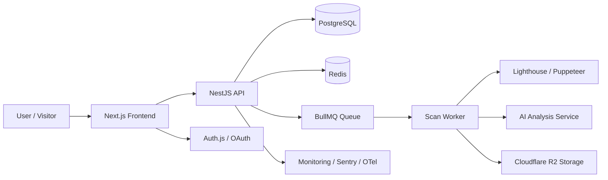

# Optimizio Performance - Architecture Diagram

## Overview
Optimizio Performance is a modular SaaS platform with a Next.js frontend, a NestJS backend, PostgreSQL, Redis, and background job processing for scans and AI analysis.

## Core Layers
- Presentation: Next.js App Router, Tailwind, shadcn/ui, Framer Motion
- Application: NestJS modules for auth, projects, scans, analytics, reports, subscriptions
- Data: Prisma ORM, PostgreSQL, Redis for caching and queues
- Integrations: Lighthouse, Puppeteer, AI analysis, email notifications, monitoring
- Infrastructure: Docker, GitHub Actions, Vercel/Railway/Neon/Redis Cloud
