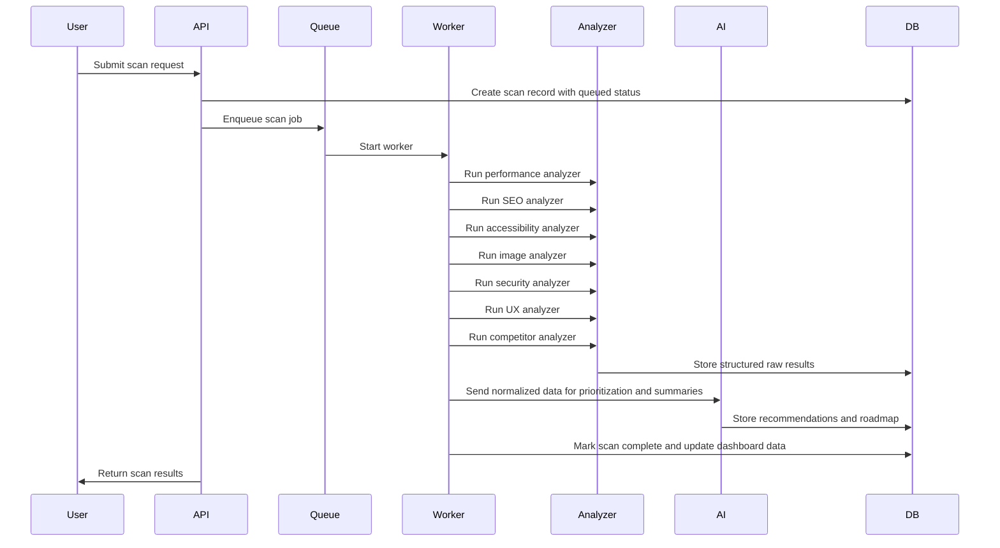

# Optimizio Performance - Advanced Audit Engine Architecture

## Overview
The audit engine will be modular, queue-based, and designed so each analyzer can run independently and contribute structured data to a shared results model.

## Core Design Principles
- Separate analyzers for each domain
- Shared scan context and result contract
- Background execution with retries and progress tracking
- AI layer consumes normalized analyzer output
- Future providers can be swapped without rewriting analyzers

## Analyzer Modules

### 1. Performance Analyzer
Responsibilities:
- Measure Core Web Vitals: LCP, CLS, INP, FCP, TTFB
- Analyze loading metrics, request counts, page size, JS/CSS size, font loading
- Detect third-party scripts, blocking resources, slow APIs, and large files
Output:
- score
- metrics
- issues
- recommendations
- estimatedImpact

### 2. Image Optimization Analyzer
Responsibilities:
- Inspect image sizes and formats
- Detect missing WebP/AVIF usage
- Detect missing lazy loading and oversized images
Output:
- score
- issues
- recommendations
- estimatedImprovement

### 3. SEO Analyzer
Responsibilities:
- Audit title, meta description, canonical, robots, sitemap, HTTPS, redirects, schema, Open Graph
- Review heading structure, internal links, alt text, content hierarchy, duplicate signals
Output:
- score
- issues
- recommendations

### 4. Accessibility Analyzer
Responsibilities:
- Check missing alt text, contrast, keyboard issues, form labels, ARIA, heading hierarchy, semantic HTML
Output:
- score
- issues
- recommendations

### 5. Security Analyzer
Responsibilities:
- Verify HTTPS and certificate validity
- Inspect security headers and cookie flags
Output:
- score
- issues
- recommendations

### 6. Technology Detection Analyzer
Responsibilities:
- Detect frontend framework, CMS, CDN, host, analytics tools
Output:
- technologyProfile
- confidence

### 7. UX Intelligence Analyzer
Responsibilities:
- Assess CTA clarity, visual hierarchy, content readability, navigation clarity, trust signals, mobile experience
Output:
- score
- insights
- recommendations

### 8. Conversion Optimization Analyzer
Responsibilities:
- Check CTA visibility, contact options, forms, trust signals, testimonials, pricing visibility
Output:
- score
- recommendations

### 9. Competitor Analyzer
Responsibilities:
- Compare the target site against up to 3 competitors across performance, SEO, accessibility, security, and UX
Output:
- ranking
- strengths
- weaknesses
- recommendations

## Scan Execution Flow



## Shared Scan Result Contract
Each analyzer should return a normalized object:

```ts
interface AnalyzerResult {
  analyzer: string;
  score: number;
  issues: Array<{
    title: string;
    severity: 'critical' | 'high' | 'medium' | 'low';
    description: string;
    whyItMatters: string;
    recommendation: string;
    estimatedImpact?: string;
  }>;
  recommendations: string[];
  metadata?: Record<string, unknown>;
}
```

## Processing Model
- Queue-based processing with BullMQ
- Retry policy for transient failures
- Timeout handling per analyzer
- Progress updates: queued, running, analyzing, finalizing, completed, failed
- Scalable workers with concurrency caps

## AI Layer Integration
- AI service consumes normalized analyzer outputs
- Summarizes issues into executive insights
- Generates prioritized roadmap based on impact, effort, and expected gain
- Supports provider abstraction for OpenAI, Anthropic, and future providers
