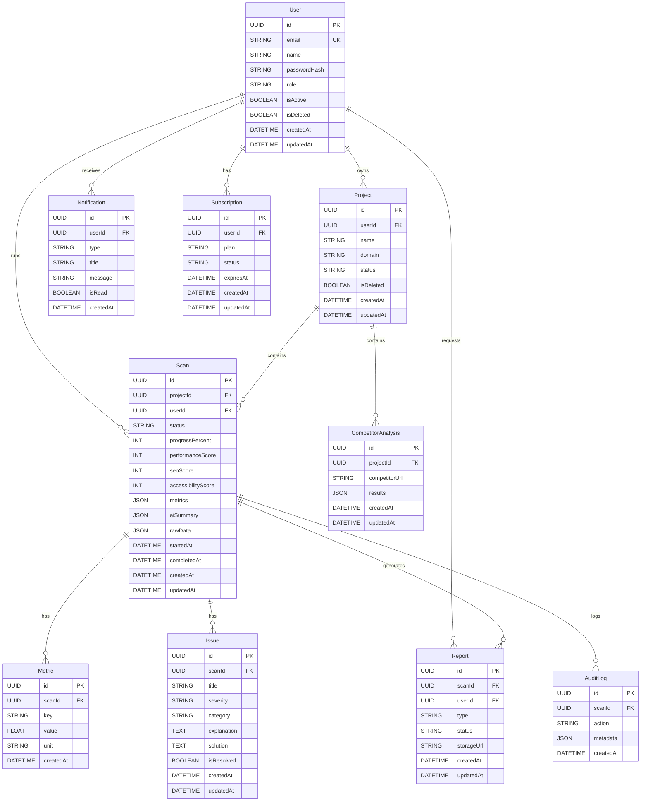

# Optimizio Performance - Detailed Database ERD

## Entities and Relationships

## Recommended Indexes
- User: email, role, createdAt
- Project: userId, domain, status, createdAt
- Scan: projectId, status, createdAt, performanceScore
- Report: userId, scanId, status, createdAt

## Constraints
- Email must be unique
- Project domain must be validated
- Scan status must be constrained to an enum-like set
- Soft delete should be supported with isDeleted flags
- createdAt and updatedAt are required across core entities
