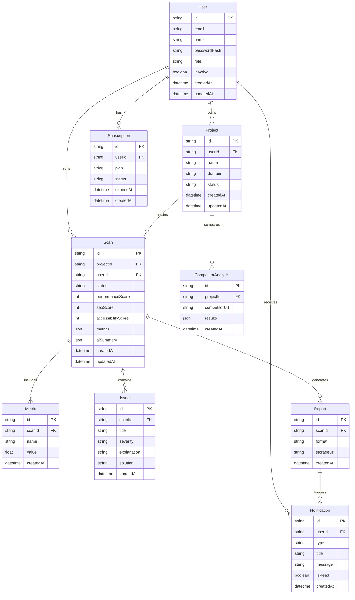

# Optimizio Performance - Database ERD

## Core Entities

## Notes
- The schema is designed for MVP delivery first, with room for team ownership, permissions, and agency features in later phases.
- Metrics and issues are stored per scan to support historical trends and timeline charts.
