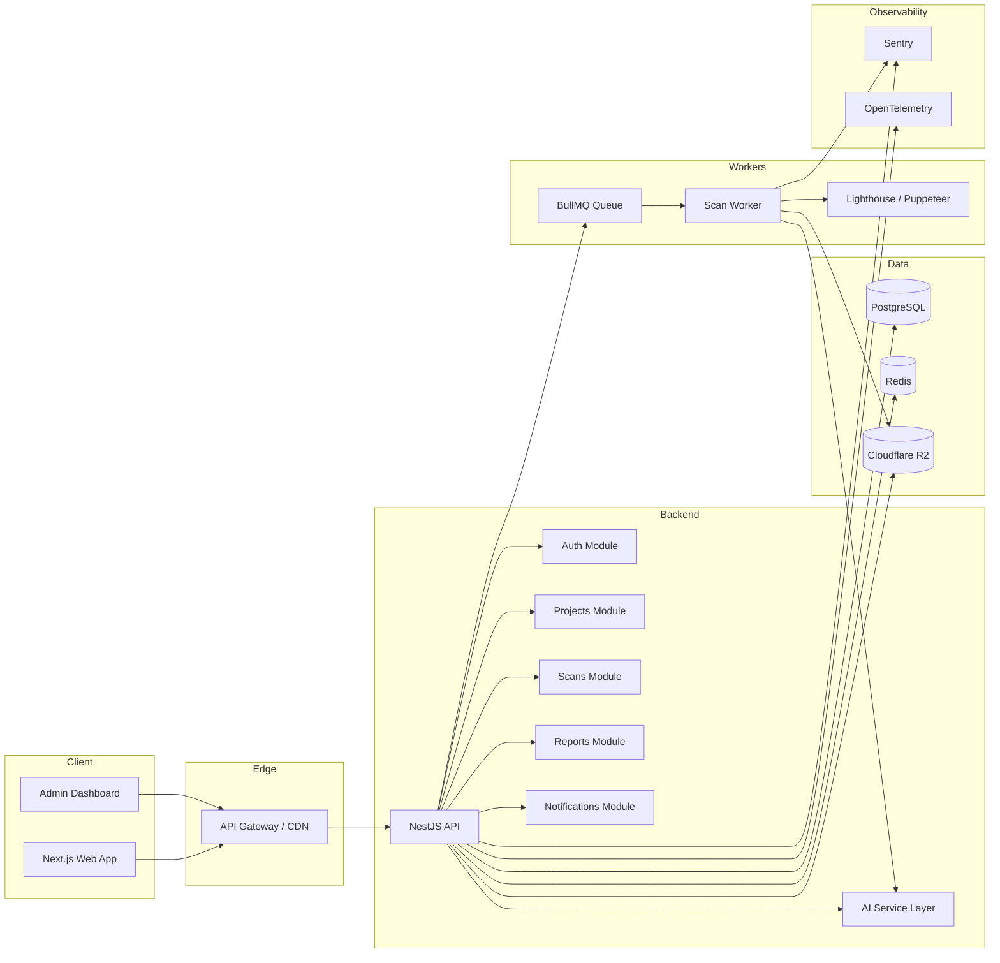

# Optimizio Performance - Complete System Architecture

## 1. High-Level Architecture

## 2. Frontend Architecture
- Next.js 15 App Router
- Server Components for marketing pages and static content
- Client Components for dashboards, auth interactions, scan forms, and charts
- React Query for server-state caching
- Local state for form and UI interactions
- Tailwind + shadcn/ui for a consistent design system
- Framer Motion for premium transitions

## 3. Backend Architecture
- NestJS modules with a clean layered approach
- Controllers for HTTP endpoints
- Services for business logic
- Repositories / Prisma service for persistence
- Queue workers for asynchronous scan execution
- Integrations for Lighthouse, Puppeteer, AI providers, notifications, and storage

## 4. Worker Architecture
- Queue-based processing using BullMQ
- Each scan goes through states: queued, running, completed, failed, timed_out
- Workers support retries with exponential backoff
- Concurrency limits protect external resources and providers

## 5. AI Integration Flow
- AI provider abstraction using an interface layer
- Providers: OpenAI, Anthropic, and future adapters
- AI tasks: analyze scan results, explain issues, generate fixes, create summaries, compare competitors
- Prompt templates and response validation
- Cache AI responses to reduce cost and latency

## 6. Database Communication
- Prisma ORM for schema definition and migrations
- PostgreSQL for transactional data
- Redis for caching and queues
- Cloudflare R2 for uploaded reports and screenshots

## 7. Observability and Reliability
- Health endpoints: /health and /ready
- Sentry for error capture
- OpenTelemetry for tracing and metrics
- Structured logging and request correlation IDs
